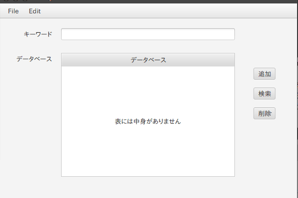

# UnifyGUI

ユニフィケーションアルゴリズムを検索に利用し、簡易的なデータベースを実装したGUIアプリケーション。

## How to use
```
git clone https://github.com/shimtom/UnifyGUI.git
java -jar ./UnifyGUI/out/artifacts/UnifyGUI/UnifyGUI.jar
```

文字列を入力し、ボタンをクリックすれば追加、検索、削除が実行できる。
また、文字列は`,`を区切り文字に使用し、複c数入力できる。
`?`を先頭に使用した単語(e.g. ?x , ?y )は変数として使用できる。

## Preview

## Key
| Key                | Command | Action                     |
| :----------------- | :------ | :------------------------- |
| `ctrl + N`         | New     | ファイルの新規作成         |
| `ctrl + O`         | Open    | ファイルを開く             |
| `ctrl +S`          | Save    | ファイルを保存             |
| `ctrl + W`         | Save As | 名前を付けてファイルを保存 |
| `ctrl + Z`         | Undo    | 元に戻す                   |
| `ctrl + shift + Z` | Redo    | やり直す                   |
| `ctrl + X`         | Cut     | 切り取り                   |
| `ctrl + C`         | Copy    | コピー                     |
| `ctrl + V`         | Paste   | 貼り付け                   |
